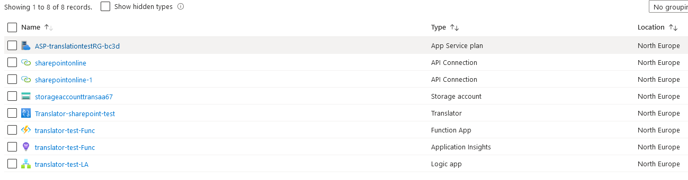

# Introduction

This solution is made for automatically translating Sharepoint pages to the desired language when creating a translation for the page in Sharepoint. The solution consists of a Azure Translator service, Azure function app, Azure Logic app. 

The solution was originally created because of a sales case where the customer said that they need their intranet pages to be translated to certain languages every time a page is created. After the first translation there was no need to automatically translate a modified page the customer was willing to change the page after modifying the page afterwards. But, of course the solution can be expanded to take care of modified pages also.

# Getting started 

You can get the code by cloning The Azure repo to your machine. Few prequisites are needed for testing the code:
	- You will need an **Azure subscription** for setting up the Azure environment
	- You will need a **M365 tenant** where to test the sharepoint page translation
	- The code has been developed with the help of VSCode and "Azure Tools" extension pack and it is recommended to develop the solution with the help of these tools. (To make it a bit easier for you!)
	- Knowledge of powershell, powershell modules and Azure development is recommended but you can learn it while doing with the help of Microsoft documentation.
	- The code uses PnP powershell module which is required for the powershell script to work.
	***NOTE! The PnP powershell is an evolving module and the commands and internals of the module can change which then requires for modifications to the code.***

# Build and test

### The local testing guide
1. Clone the repository to your system
2. Open the translator-test-Func folder 
3. Run the command "func start", to test that the function works (***Note! You need to have Azure tools extension pack installed***)
4. Create a resource group where you will also create an Azure Translator service instance (Help => https://docs.microsoft.com/en-us/azure/cognitive-services/translator/how-to-create-translator-resource)
5. After creating the resource you have to update the **HttpTrigger2 function** Translator key environment variable matching your Translator instance
6. Then run the azure function locally with ""**func start**"" cmdlet
7. After the function is running go create a Sharepoint page with text blocks in some language. Then create a Sharepoint page translation for the page (HELP => https://support.microsoft.com/en-us/office/create-multilingual-sharepoint-sites-pages-and-news-2bb7d610-5453-41c6-a0e8-6f40b3ed750c) ***NOTE! Do not modify the translated page after creating the translation, the script will do that for you.***
8. After creating the translated page send the function the siteUrl, pageTitle and language property in the body of a REST request (recommended to use some type of REST api program e.g. Nightingale, PostMan, insomnia etc.) 
9. After the script has run the translated page should have been translated.

### Deploying the solution

The solutions arm template is found from the arm-template folder which can be deployed to the Azure environment (HELP => https://docs.microsoft.com/en-us/azure/azure-resource-manager/templates/deploy-powershell)

The following results are the resources used in the solution.

# Contribute

The solution can be improved by
1. Getting the solution to work with multiple site collections (maybe Sharepoint extensions)
2. Also the solution does not translate other areas than text blocks. So the question is can the solution can be extended to other web parts? Maybe even custom ones?
3.  Also adding the Application insight following the solution (at the moment it is only a decoration ***WHICH SHOULD BE USED!***)
4.  Translation service can also be used for translating other stuff than purely text e.g. documents and creating custom translator for terminology and/or specific language
5. Translator can be expanded in so many ways for other sites than Sharepoint and the solution can be e.g. transformed to an SaaS with a real backend and API management solution for customers wanting to translate different areas of their environment.